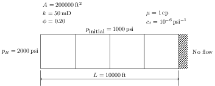

# Homework Assignment 12


## Instructions

Consider the reservoir shown below with the given properties that has been discretized into 4 equal grid blocks.



Extending the code you wrote for [Assignment 11](https://github.com/PGE323M-Students/assignment11), add functionality to the `solve_one_step()` method to implement a *mixed method* solver with a user specified value of &#952;.  From the users perspective, this should be called from the input parameters as 

```yaml
'numerical': 
    'solver': 
        'mixed method': 
            'theta': 1.0
```

where the value 1.0 in this example could be set for to any value between 0 and 1.  

You may continue this implementation from your `assignment11.ipynb` submission, but you must rename the file to
`assignment12.ipynb` and add it to this git repository before submission. 

## Testing

If you would like to check to see if your solution is correct, run the following command at the Terminal command line:

```bash
python test.py
```

a status message of `OK` indicates that the solution is correct.
